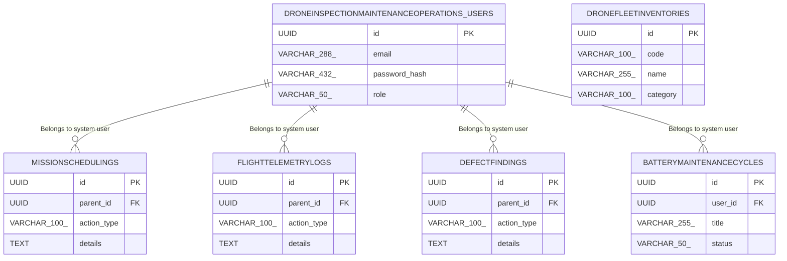

# Database Specification

> **DBMS Engine**: PostgreSQL  
> **Database Name**: drone_inspection___maintenance_operations  
> **Domain Industry**: Drone Inspection & Maintenance Operations Platform  
> **Database Complexity**: relational_fk  

---

## 1. Database Overview
Relational schema design for **Drone Inspection & Maintenance Operations** supporting ACID transactional integrity across 6 domain entity tables, optimized for the custom sector.

## 2. Database Technology
Database Engine: **PostgreSQL** configured specifically for Drone Inspection & Maintenance Operations schema storage with connection pooling.

## 3. Database Architecture
Primary-Replica HA deployment model supporting serverless_edge scalability requirements of Drone Inspection & Maintenance Operations.

## 4. Schema Overview
Relational tables cataloging domain entities for Drone Inspection & Maintenance Operations Platform: `droneinspectionmaintenanceoperations_users`, `dronefleetinventories`, `missionschedulings`, `flighttelemetrylogs`, `defectfindings`, `batterymaintenancecycles`.

## 5. Entity Relationship Diagram

## 6. Tables
Primary entity tables: `droneinspectionmaintenanceoperations_users`, `dronefleetinventories`, `missionschedulings`, `flighttelemetrylogs`, `defectfindings`, `batterymaintenancecycles`, and system `drone_inspection___maintenance_operations_audit_logs`.

## 7. Columns & Data Types
**droneinspectionmaintenanceoperations_users**: `id` (UUID), `email` (VARCHAR(288)), `password_hash` (VARCHAR(432)), `role` (VARCHAR(50)), `created_at` (TIMESTAMP WITH TIME ZONE)

**dronefleetinventories**: `id` (UUID), `code` (VARCHAR(100)), `name` (VARCHAR(255)), `category` (VARCHAR(100)), `status` (VARCHAR(50)), `created_at` (TIMESTAMP WITH TIME ZONE)

**missionschedulings**: `id` (UUID), `parent_id` (UUID), `action_type` (VARCHAR(100)), `details` (TEXT), `created_at` (TIMESTAMP WITH TIME ZONE)

**flighttelemetrylogs**: `id` (UUID), `parent_id` (UUID), `action_type` (VARCHAR(100)), `details` (TEXT), `created_at` (TIMESTAMP WITH TIME ZONE)

**defectfindings**: `id` (UUID), `parent_id` (UUID), `action_type` (VARCHAR(100)), `details` (TEXT), `created_at` (TIMESTAMP WITH TIME ZONE)

**batterymaintenancecycles**: `id` (UUID), `user_id` (UUID), `title` (VARCHAR(255)), `status` (VARCHAR(50)), `created_at` (TIMESTAMP WITH TIME ZONE)

## 8. Primary Keys
All Drone Inspection & Maintenance Operations domain tables enforce RFC 4122 random UUID primary keys.

## 9. Foreign Keys
`missionschedulings.user_id` → `droneinspectionmaintenanceoperations_users.id` ON DELETE CASCADE

`flighttelemetrylogs.user_id` → `droneinspectionmaintenanceoperations_users.id` ON DELETE CASCADE

`defectfindings.user_id` → `droneinspectionmaintenanceoperations_users.id` ON DELETE CASCADE

`batterymaintenancecycles.user_id` → `droneinspectionmaintenanceoperations_users.id` ON DELETE CASCADE

## 10. Relationships
**MissionScheduling → User**: Belongs to system user (1:N)

**FlightTelemetryLogs → User**: Belongs to system user (1:N)

**DefectFindings → User**: Belongs to system user (1:N)

**BatteryMaintenanceCycles → User**: Belongs to system user (1:N)

## 11. Constraints
NOT NULL (email, password_hash, role); UNIQUE (email); NOT NULL (code, name, status); UNIQUE (code); NOT NULL (action_type, created_at); NOT NULL (action_type, created_at); NOT NULL (action_type, created_at); NOT NULL (title, status)

## 12. Unique Constraints
UNIQUE indexes on natural key identifiers and authentication email addresses in the drone_inspection___maintenance_operations catalog.

## 13. Indexes
idx_droneinspectionmaintenanceoperations_users_email (email), idx_droneinspectionmaintenanceoperations_users_role (role), idx_dronefleetinventories_code (code), idx_dronefleetinventories_status (status), idx_missionschedulings_created (created_at), idx_flighttelemetrylogs_created (created_at), idx_defectfindings_created (created_at), idx_batterymaintenancecycles_user (user_id), idx_batterymaintenancecycles_status (status)

## 14. Database Business Rules
Enforces domain business state transitions across entity lifecycles (pending_activation, active, suspended, archived, available, reserved).

## 15. Authentication Data
User credentials and security tokens managed in `droneinspectionmaintenanceoperations_users` with Argon2id hashing.

## 16. Authorization Data
Role-Based Access Control (RBAC) permissions stored in `droneinspectionmaintenanceoperations_users.role` attributes.

## 17. Row-Level Security / Access Policies
PostgreSQL Row-Level Security (RLS) policies enabled on `droneinspectionmaintenanceoperations_users`, `dronefleetinventories`, `missionschedulings`, `flighttelemetrylogs`, `defectfindings`, `batterymaintenancecycles` for client-level isolation.

## 18. Data Validation
CHECK constraints enforcing positive boundaries and non-empty strings on Drone Inspection & Maintenance Operations records.

## 19. Migrations
Version-controlled SQL migration scripts executing pre-release schema updates for the drone_inspection___maintenance_operations schema.

## 20. Seed Data
Initial development seed fixtures for `droneinspectionmaintenanceoperations_users`, `dronefleetinventories`, `missionschedulings`, `flighttelemetrylogs`, `defectfindings`, `batterymaintenancecycles`.

## 21. Transactions & Data Integrity
ACID transactional boundaries with SERIALIZABLE isolation for mutations in Drone Inspection & Maintenance Operations.

## 22. Backup & Recovery
Automated WAL archive snapshots for Drone Inspection & Maintenance Operations with point-in-time recovery (PITR).

## 23. Database Security
Encrypted connections requiring TLS 1.3 and secret key vault integration for Drone Inspection & Maintenance Operations.

## 24. Performance Considerations
Sub-50ms query latency targets using EXPLAIN ANALYZE execution plan auditing on the PostgreSQL engine.

## 25. Data Retention
Soft-delete pattern with 90-day archive retention policies.

## 26. Database Change Log
Audit table logging schema migration versions for Drone Inspection & Maintenance Operations.