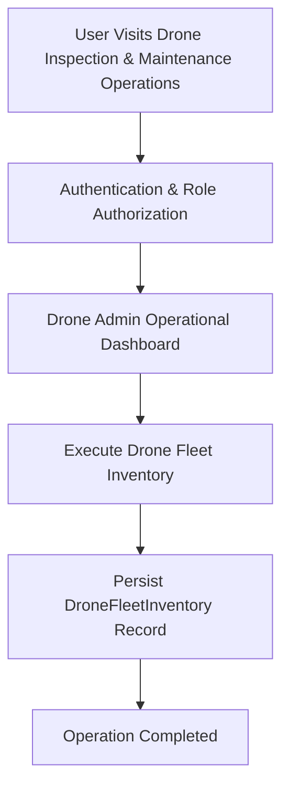

# Product Requirements Document

> **Document Status**: APPROVED & ACTIVE  
> **Target System**: Drone Inspection & Maintenance Operations  
> **Industry Domain**: Drone Inspection & Maintenance Operations Platform  
> **Risk Level**: LOW  
> **Data Sensitivity**: 3/10  

---

## 1. Product Overview
Operational platform for scheduling drone inspection missions, managing drones and operators, recording flight telemetry and inspection findings, and tracking battery maintenance cycles.

- Category: Drone Inspection & Maintenance Operations Platform
- Core Tech Stack: Next.js, TypeScript, PostgreSQL, REST API
- Primary Database Engine: PostgreSQL

## 2. Problem Statement
> [!IMPORTANT]
> **Core Domain Challenge**
> Drone Inspection & Maintenance Operations resolves critical domain operational challenges: Drone Inspection & Maintenance Operations resolves critical domain operational challenges: Operational platform for scheduling drone inspection missions, managing drones and operators, recording flight telemetry and inspection findings, and tracking battery maintenance cycles.

## 3. Goals & Objectives
1. Achieve automated workflows for Drone Fleet Inventory.
2. Achieve automated workflows for Inspection Mission Scheduling.
3. Achieve automated workflows for Flight Telemetry Logs.
4. Achieve automated workflows for Inspection Defect Findings.
5. Achieve automated workflows for Battery Maintenance Cycles.

## 4. Non-Goals
- Legacy batch data ETL migration tooling for DroneFleetInventory.
- Native desktop OS executable packaging for non-web environments.
- Hardware-level low-level firmware flashing for third-party peripheral sensors.

## 5. Target Users
Target user demographics for **Drone Inspection & Maintenance Operations** across Drone Inspection & Maintenance Operations Platform operations:

- Drone Admin: Needs Full control over Drone Inspection & Maintenance Operations operations and data management.
- End User: Needs Execute daily Drone Inspection & Maintenance Operations operational tasks.

## 6. User Personas
| Persona Name | Role | Primary Pain Point | Key Motivation |
| :--- | :--- | :--- | :--- |
| Persona: Drone Admin | Drone Admin | Experiencing manual processing overhead in Full control over Drone Inspection & Maintenance Operations operations and data management. | Wants streamlined automated interface for Full control over Drone Inspection & Maintenance Operations operations and data management. |
| Persona: End User | End User | Experiencing manual processing overhead in Execute daily Drone Inspection & Maintenance Operations operational tasks. | Wants streamlined automated interface for Execute daily Drone Inspection & Maintenance Operations operational tasks. |

## 7. User Roles
| Role | Core Need | Permission Level |
| :--- | :--- | :--- |
| Drone Admin | Full control over Drone Inspection & Maintenance Operations operations and data management. | Clearance Level 3 |
| End User | Execute daily Drone Inspection & Maintenance Operations operational tasks. | Clearance Level 1 |

## 8. User Stories
*   *"As a Drone Admin, I want to execute Drone Fleet Inventory so data is synchronized accurately across the system."*

*   *"As a Drone Admin, I want to execute Inspection Mission Scheduling so data is synchronized accurately across the system."*

*   *"As a Drone Admin, I want to execute Flight Telemetry Logs so data is synchronized accurately across the system."*

*   *"As a Drone Admin, I want to execute Inspection Defect Findings so data is synchronized accurately across the system."*

*   *"As a Drone Admin, I want to execute Battery Maintenance Cycles so data is synchronized accurately across the system."*

## 9. Functional Requirements
**Requirement 9.1 (Drone Fleet Inventory)**: System must execute automated processing for Drone Fleet Inventory with input validation.

**Requirement 9.2 (Inspection Mission Scheduling)**: System must execute automated processing for Inspection Mission Scheduling with input validation.

**Requirement 9.3 (Flight Telemetry Logs)**: System must execute automated processing for Flight Telemetry Logs with input validation.

**Requirement 9.4 (Inspection Defect Findings)**: System must execute automated processing for Inspection Defect Findings with input validation.

**Requirement 9.5 (Battery Maintenance Cycles)**: System must execute automated processing for Battery Maintenance Cycles with input validation.

## 10. Non-Functional Requirements
- Performance: Sub-100ms client reactivity, <500ms API response latency for 95th percentile.
- Security: Data Sensitivity Score 3/10 with strict Zero Trust access control.
- Reliability: 99.9% uptime SLA with automated fallback boundaries.

## 11. Product Features
- Feature Module: Drone Fleet Inventory
- Feature Module: Inspection Mission Scheduling
- Feature Module: Flight Telemetry Logs
- Feature Module: Inspection Defect Findings
- Feature Module: Battery Maintenance Cycles

## 12. User Flows

## 13. Scope
### 13.1 In Scope
- Core Workflow: Drone Fleet Inventory
- Core Workflow: Inspection Mission Scheduling
- Core Workflow: Flight Telemetry Logs
- Core Workflow: Inspection Defect Findings
- Core Workflow: Battery Maintenance Cycles

### 13.2 Out of Scope
- Legacy batch data ETL migration tooling for DroneFleetInventory.
- Native desktop OS executable packaging for non-web environments.
- Hardware-level low-level firmware flashing for third-party peripheral sensors.

## 14. Business Rules
- Rule BR-01: Drone inspection missions cannot be dispatched if assigned aircraft battery health drops below 80%.
- Rule BR-02: Flight telemetry logs must stream continuous GPS waypoints and be verified before closing mission findings.
- Rule BR-03: Autonomous flight paths must restrict operations within FAA airspace regulatory boundaries.
- Rule BR-04: Defect findings flagged during inspection missions require certified engineer sign-off for maintenance clearance.

## 15. Acceptance Criteria
- [ ] Verify automated workflow for Drone Fleet Inventory
- [ ] Verify automated workflow for Inspection Mission Scheduling
- [ ] Verify automated workflow for Flight Telemetry Logs
- [ ] Verify automated workflow for Inspection Defect Findings
- [ ] Verify automated workflow for Battery Maintenance Cycles

## 16. Success Metrics / KPIs
- 95% reduction in manual data processing time.
- Zero critical security vulnerabilities on production release.

## 17. Constraints
- Constraint: Zero plaintext credentials
- Constraint: Strict type safety

## 18. Dependencies
- Database Service: PostgreSQL cluster availability.
- Runtime Platform: Node.js / Serverless Edge runtime environment.

## 19. Assumptions
- Users access the system using modern standards-compliant web browsers.
- Network latency to application host remains under 150ms.

## 20. Risks
> [!WARNING]
> **Risk Factor**
> Risk Level LOW: Potential operational delay if external infrastructure or database availability drops below target SLA.

## 21. Future Considerations
- Automated AI-assisted workflow predictive reporting for Drone Fleet Inventory.
- Realtime WebSockets push notification infrastructure for DroneFleetInventory updates.
- Mobile native app SDK integration for on-the-field operators.