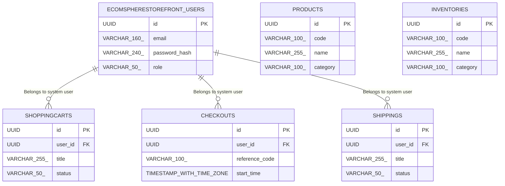

# Database Specification

> **DBMS Engine**: PostgreSQL  
> **Database Name**: ecomsphere_storefront  
> **Domain Industry**: EcomSphere Storefront Platform  
> **Database Complexity**: relational_fk  

---

## 1. Database Overview
Relational schema design for **EcomSphere Storefront** supporting ACID transactional integrity across 6 domain entity tables, optimized for the ecommerce sector.

## 2. Database Technology
Database Engine: **PostgreSQL** configured specifically for EcomSphere Storefront schema storage with connection pooling.

## 3. Database Architecture
Primary-Replica HA deployment model supporting serverless_edge scalability requirements of EcomSphere Storefront.

## 4. Schema Overview
Relational tables cataloging domain entities for EcomSphere Storefront Platform: `ecomspherestorefront_users`, `products`, `inventories`, `shoppingcarts`, `checkouts`, `shippings`.

## 5. Entity Relationship Diagram

## 6. Tables
Primary entity tables: `ecomspherestorefront_users`, `products`, `inventories`, `shoppingcarts`, `checkouts`, `shippings`, and system `ecomsphere_storefront_audit_logs`.

## 7. Columns & Data Types
**ecomspherestorefront_users**: `id` (UUID), `email` (VARCHAR(160)), `password_hash` (VARCHAR(240)), `role` (VARCHAR(50)), `created_at` (TIMESTAMP WITH TIME ZONE)

**products**: `id` (UUID), `code` (VARCHAR(100)), `name` (VARCHAR(255)), `category` (VARCHAR(100)), `status` (VARCHAR(50)), `created_at` (TIMESTAMP WITH TIME ZONE)

**inventories**: `id` (UUID), `code` (VARCHAR(100)), `name` (VARCHAR(255)), `category` (VARCHAR(100)), `status` (VARCHAR(50)), `created_at` (TIMESTAMP WITH TIME ZONE)

**shoppingcarts**: `id` (UUID), `user_id` (UUID), `title` (VARCHAR(255)), `status` (VARCHAR(50)), `created_at` (TIMESTAMP WITH TIME ZONE)

**checkouts**: `id` (UUID), `user_id` (UUID), `reference_code` (VARCHAR(100)), `start_time` (TIMESTAMP WITH TIME ZONE), `end_time` (TIMESTAMP WITH TIME ZONE), `status` (VARCHAR(50))

**shippings**: `id` (UUID), `user_id` (UUID), `title` (VARCHAR(255)), `status` (VARCHAR(50)), `created_at` (TIMESTAMP WITH TIME ZONE)

## 8. Primary Keys
All EcomSphere Storefront domain tables enforce RFC 4122 random UUID primary keys.

## 9. Foreign Keys
`shoppingcarts.user_id` → `ecomspherestorefront_users.id` ON DELETE CASCADE

`checkouts.user_id` → `ecomspherestorefront_users.id` ON DELETE CASCADE

`shippings.user_id` → `ecomspherestorefront_users.id` ON DELETE CASCADE

## 10. Relationships
**ShoppingCart → User**: Belongs to system user (1:N)

**Checkout → User**: Belongs to system user (1:N)

**Shipping → User**: Belongs to system user (1:N)

## 11. Constraints
NOT NULL (email, password_hash, role); UNIQUE (email); NOT NULL (code, name, status); UNIQUE (code); NOT NULL (code, name, status); UNIQUE (code); NOT NULL (title, status); NOT NULL (user_id, reference_code, status); UNIQUE (reference_code); NOT NULL (title, status)

## 12. Unique Constraints
UNIQUE indexes on natural key identifiers and authentication email addresses in the ecomsphere_storefront catalog.

## 13. Indexes
idx_ecomspherestorefront_users_email (email), idx_ecomspherestorefront_users_role (role), idx_products_code (code), idx_products_status (status), idx_inventories_code (code), idx_inventories_status (status), idx_shoppingcarts_user (user_id), idx_shoppingcarts_status (status), idx_checkouts_user (user_id), idx_checkouts_ref (reference_code), idx_shippings_user (user_id), idx_shippings_status (status)

## 14. Database Business Rules
Enforces domain business state transitions across entity lifecycles (pending_activation, active, suspended, archived, available, reserved).

## 15. Authentication Data
User credentials and security tokens managed in `ecomspherestorefront_users` with Argon2id hashing.

## 16. Authorization Data
Role-Based Access Control (RBAC) permissions stored in `ecomspherestorefront_users.role` attributes.

## 17. Row-Level Security / Access Policies
PostgreSQL Row-Level Security (RLS) policies enabled on `ecomspherestorefront_users`, `products`, `inventories`, `shoppingcarts`, `checkouts`, `shippings` for client-level isolation.

## 18. Data Validation
CHECK constraints enforcing positive boundaries and non-empty strings on EcomSphere Storefront records.

## 19. Migrations
Version-controlled SQL migration scripts executing pre-release schema updates for the ecomsphere_storefront schema.

## 20. Seed Data
Initial development seed fixtures for `ecomspherestorefront_users`, `products`, `inventories`, `shoppingcarts`, `checkouts`, `shippings`.

## 21. Transactions & Data Integrity
ACID transactional boundaries with SERIALIZABLE isolation for mutations in EcomSphere Storefront.

## 22. Backup & Recovery
Automated WAL archive snapshots for EcomSphere Storefront with point-in-time recovery (PITR).

## 23. Database Security
Encrypted connections requiring TLS 1.3 and secret key vault integration for EcomSphere Storefront.

## 24. Performance Considerations
Sub-50ms query latency targets using EXPLAIN ANALYZE execution plan auditing on the PostgreSQL engine.

## 25. Data Retention
Soft-delete pattern with 90-day archive retention policies.

## 26. Database Change Log
Audit table logging schema migration versions for EcomSphere Storefront.