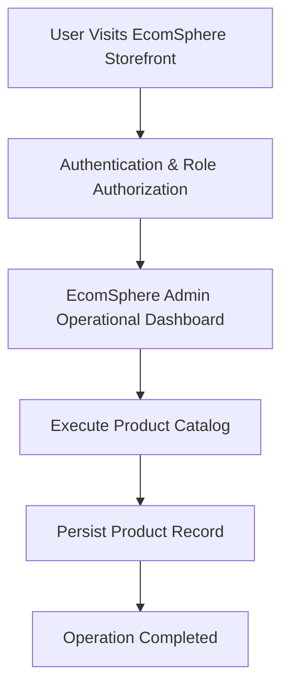

# Product Requirements Document

> **Document Status**: APPROVED & ACTIVE  
> **Target System**: EcomSphere Storefront  
> **Industry Domain**: EcomSphere Storefront Platform  
> **Risk Level**: HIGH  
> **Data Sensitivity**: 5/10  

---

## 1. Product Overview
Online shop hosting product catalog, inventory tracking, shopping cart, checkout, and shipping.

- Category: EcomSphere Storefront Platform
- Core Tech Stack: Next.js, TypeScript, PostgreSQL, REST API
- Primary Database Engine: PostgreSQL

## 2. Problem Statement
> [!IMPORTANT]
> **Core Domain Challenge**
> EcomSphere Storefront resolves critical domain operational challenges: EcomSphere Storefront resolves critical domain operational challenges: Online shop hosting product catalog, inventory tracking, shopping cart, checkout, and shipping.

## 3. Goals & Objectives
1. Achieve automated workflows for Product Catalog.
2. Achieve automated workflows for Inventory Tracking.
3. Achieve automated workflows for Shopping Cart.
4. Achieve automated workflows for Checkout.
5. Achieve automated workflows for Shipping.

## 4. Non-Goals
- Legacy batch data ETL migration tooling for Product.
- Native desktop OS executable packaging for non-web environments.
- Hardware-level low-level firmware flashing for third-party peripheral sensors.

## 5. Target Users
Target user demographics for **EcomSphere Storefront** across EcomSphere Storefront Platform operations:

- EcomSphere Admin: Needs Full control over EcomSphere Storefront operations and data management.
- Fleet Manager: Needs Track vehicle availability and maintain fleet condition.
- Customer / Renter: Needs Reserve vehicles online and process rental returns.

## 6. User Personas
| Persona Name | Role | Primary Pain Point | Key Motivation |
| :--- | :--- | :--- | :--- |
| Persona: EcomSphere Admin | EcomSphere Admin | Experiencing manual processing overhead in Full control over EcomSphere Storefront operations and data management. | Wants streamlined automated interface for Full control over EcomSphere Storefront operations and data management. |
| Persona: Fleet Manager | Fleet Manager | Experiencing manual processing overhead in Track vehicle availability and maintain fleet condition. | Wants streamlined automated interface for Track vehicle availability and maintain fleet condition. |
| Persona: Customer / Renter | Customer / Renter | Experiencing manual processing overhead in Reserve vehicles online and process rental returns. | Wants streamlined automated interface for Reserve vehicles online and process rental returns. |

## 7. User Roles
| Role | Core Need | Permission Level |
| :--- | :--- | :--- |
| EcomSphere Admin | Full control over EcomSphere Storefront operations and data management. | Clearance Level 3 |
| Fleet Manager | Track vehicle availability and maintain fleet condition. | Clearance Level 2 |
| Customer / Renter | Reserve vehicles online and process rental returns. | Clearance Level 1 |

## 8. User Stories
*   *"As a EcomSphere Admin, I want to execute Product Catalog so data is synchronized accurately across the system."*

*   *"As a EcomSphere Admin, I want to execute Inventory Tracking so data is synchronized accurately across the system."*

*   *"As a EcomSphere Admin, I want to execute Shopping Cart so data is synchronized accurately across the system."*

*   *"As a EcomSphere Admin, I want to execute Checkout so data is synchronized accurately across the system."*

*   *"As a EcomSphere Admin, I want to execute Shipping so data is synchronized accurately across the system."*

## 9. Functional Requirements
**Requirement 9.1 (Product Catalog)**: System must execute automated processing for Product Catalog with input validation.

**Requirement 9.2 (Inventory Tracking)**: System must execute automated processing for Inventory Tracking with input validation.

**Requirement 9.3 (Shopping Cart)**: System must execute automated processing for Shopping Cart with input validation.

**Requirement 9.4 (Checkout)**: System must execute automated processing for Checkout with input validation.

**Requirement 9.5 (Shipping)**: System must execute automated processing for Shipping with input validation.

## 10. Non-Functional Requirements
- Performance: Sub-100ms client reactivity, <500ms API response latency for 95th percentile.
- Security: Data Sensitivity Score 5/10 with strict Zero Trust access control.
- Reliability: 99.9% uptime SLA with automated fallback boundaries.

## 11. Product Features
- Feature Module: Product Catalog
- Feature Module: Inventory Tracking
- Feature Module: Shopping Cart
- Feature Module: Checkout
- Feature Module: Shipping

## 12. User Flows

## 13. Scope
### 13.1 In Scope
- Core Workflow: Product Catalog
- Core Workflow: Inventory Tracking
- Core Workflow: Shopping Cart
- Core Workflow: Checkout
- Core Workflow: Shipping

### 13.2 Out of Scope
- Legacy batch data ETL migration tooling for Product.
- Native desktop OS executable packaging for non-web environments.
- Hardware-level low-level firmware flashing for third-party peripheral sensors.

## 14. Business Rules
- Rule BR-01: Product stock inventory is reserved for 15 minutes during customer cart checkout.
- Rule BR-02: Order fulfillment dispatch cannot occur prior to confirmed payment gateway webhook verification.
- Rule BR-03: Refunds cannot exceed the original transaction captured amount.
- Rule BR-04: Out-of-stock items automatically disable checkout authorization until inventory replenishment.

## 15. Acceptance Criteria
- [ ] Verify automated workflow for Product Catalog
- [ ] Verify automated workflow for Inventory Tracking
- [ ] Verify automated workflow for Shopping Cart
- [ ] Verify automated workflow for Checkout
- [ ] Verify automated workflow for Shipping

## 16. Success Metrics / KPIs
- 95% reduction in manual data processing time.
- Zero critical security vulnerabilities on production release.

## 17. Constraints
- Constraint: Zero plaintext credentials
- Constraint: Strict type safety

## 18. Dependencies
- Database Service: PostgreSQL cluster availability.
- Runtime Platform: Node.js / Serverless Edge runtime environment.

## 19. Assumptions
- Users access the system using modern standards-compliant web browsers.
- Network latency to application host remains under 150ms.

## 20. Risks
> [!WARNING]
> **Risk Factor**
> Risk Level HIGH: Potential operational delay if external infrastructure or database availability drops below target SLA.

## 21. Future Considerations
- Automated AI-assisted workflow predictive reporting for Product Catalog.
- Realtime WebSockets push notification infrastructure for Product updates.
- Mobile native app SDK integration for on-the-field operators.