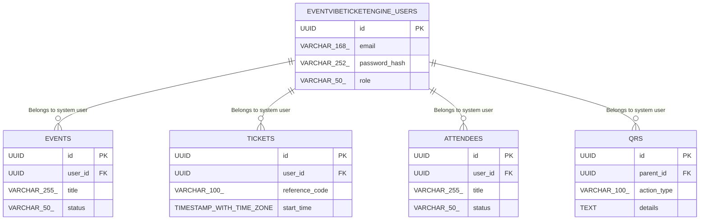

# Database Specification

> **DBMS Engine**: PostgreSQL  
> **Database Name**: eventvibe_ticket_engine  
> **Domain Industry**: EventVibe Ticket Engine Platform  
> **Database Complexity**: relational_fk  

---

## 1. Database Overview
Relational schema design for **EventVibe Ticket Engine** supporting ACID transactional integrity across 5 domain entity tables, optimized for the event sector.

## 2. Database Technology
Database Engine: **PostgreSQL** configured specifically for EventVibe Ticket Engine schema storage with connection pooling.

## 3. Database Architecture
Primary-Replica HA deployment model supporting serverless_edge scalability requirements of EventVibe Ticket Engine.

## 4. Schema Overview
Relational tables cataloging domain entities for EventVibe Ticket Engine Platform: `eventvibeticketengine_users`, `events`, `tickets`, `attendees`, `qrs`.

## 5. Entity Relationship Diagram

## 6. Tables
Primary entity tables: `eventvibeticketengine_users`, `events`, `tickets`, `attendees`, `qrs`, and system `eventvibe_ticket_engine_audit_logs`.

## 7. Columns & Data Types
**eventvibeticketengine_users**: `id` (UUID), `email` (VARCHAR(168)), `password_hash` (VARCHAR(252)), `role` (VARCHAR(50)), `created_at` (TIMESTAMP WITH TIME ZONE)

**events**: `id` (UUID), `user_id` (UUID), `title` (VARCHAR(255)), `status` (VARCHAR(50)), `created_at` (TIMESTAMP WITH TIME ZONE)

**tickets**: `id` (UUID), `user_id` (UUID), `reference_code` (VARCHAR(100)), `start_time` (TIMESTAMP WITH TIME ZONE), `end_time` (TIMESTAMP WITH TIME ZONE), `status` (VARCHAR(50))

**attendees**: `id` (UUID), `user_id` (UUID), `title` (VARCHAR(255)), `status` (VARCHAR(50)), `created_at` (TIMESTAMP WITH TIME ZONE)

**qrs**: `id` (UUID), `parent_id` (UUID), `action_type` (VARCHAR(100)), `details` (TEXT), `created_at` (TIMESTAMP WITH TIME ZONE)

## 8. Primary Keys
All EventVibe Ticket Engine domain tables enforce RFC 4122 random UUID primary keys.

## 9. Foreign Keys
`events.user_id` → `eventvibeticketengine_users.id` ON DELETE CASCADE

`tickets.user_id` → `eventvibeticketengine_users.id` ON DELETE CASCADE

`attendees.user_id` → `eventvibeticketengine_users.id` ON DELETE CASCADE

`qrs.user_id` → `eventvibeticketengine_users.id` ON DELETE CASCADE

## 10. Relationships
**Event → User**: Belongs to system user (1:N)

**Ticket → User**: Belongs to system user (1:N)

**Attendee → User**: Belongs to system user (1:N)

**Qr → User**: Belongs to system user (1:N)

## 11. Constraints
NOT NULL (email, password_hash, role); UNIQUE (email); NOT NULL (title, status); NOT NULL (user_id, reference_code, status); UNIQUE (reference_code); NOT NULL (title, status); NOT NULL (action_type, created_at)

## 12. Unique Constraints
UNIQUE indexes on natural key identifiers and authentication email addresses in the eventvibe_ticket_engine catalog.

## 13. Indexes
idx_eventvibeticketengine_users_email (email), idx_eventvibeticketengine_users_role (role), idx_events_user (user_id), idx_events_status (status), idx_tickets_user (user_id), idx_tickets_ref (reference_code), idx_attendees_user (user_id), idx_attendees_status (status), idx_qrs_created (created_at)

## 14. Database Business Rules
Enforces domain business state transitions across entity lifecycles (pending_activation, active, suspended, archived, draft, active).

## 15. Authentication Data
User credentials and security tokens managed in `eventvibeticketengine_users` with Argon2id hashing.

## 16. Authorization Data
Role-Based Access Control (RBAC) permissions stored in `eventvibeticketengine_users.role` attributes.

## 17. Row-Level Security / Access Policies
PostgreSQL Row-Level Security (RLS) policies enabled on `eventvibeticketengine_users`, `events`, `tickets`, `attendees`, `qrs` for client-level isolation.

## 18. Data Validation
CHECK constraints enforcing positive boundaries and non-empty strings on EventVibe Ticket Engine records.

## 19. Migrations
Version-controlled SQL migration scripts executing pre-release schema updates for the eventvibe_ticket_engine schema.

## 20. Seed Data
Initial development seed fixtures for `eventvibeticketengine_users`, `events`, `tickets`, `attendees`, `qrs`.

## 21. Transactions & Data Integrity
ACID transactional boundaries with SERIALIZABLE isolation for mutations in EventVibe Ticket Engine.

## 22. Backup & Recovery
Automated WAL archive snapshots for EventVibe Ticket Engine with point-in-time recovery (PITR).

## 23. Database Security
Encrypted connections requiring TLS 1.3 and secret key vault integration for EventVibe Ticket Engine.

## 24. Performance Considerations
Sub-50ms query latency targets using EXPLAIN ANALYZE execution plan auditing on the PostgreSQL engine.

## 25. Data Retention
Soft-delete pattern with 90-day archive retention policies.

## 26. Database Change Log
Audit table logging schema migration versions for EventVibe Ticket Engine.