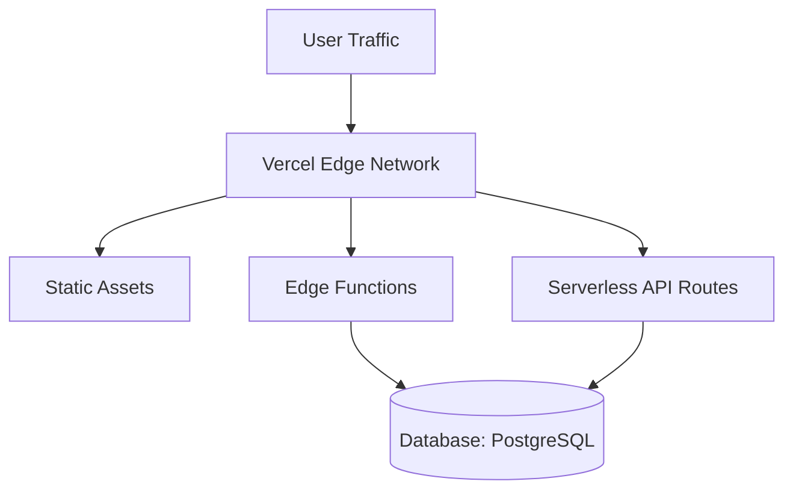

# Deployment Architecture & Operations

> **Target System**: EventVibe Ticket Engine  
> **Frontend Runtime Target**: Vercel Edge Network / Serverless Node.js  
> **Backend Runtime Target**: Next.js App Router Serverless Functions  
> **Database Target**: PostgreSQL Instance  

---

## 1. Deployment Overview
Deployment strategy for **EventVibe Ticket Engine** supporting EventVibe Ticket Engine Platform operations.

## 2. Environments
Development, Staging (isolated preview branch environments for EventVibe Ticket Engine Platform), and Production tiers.

## 3. Build Process
`next build` compiling static pages, Server Components, and Serverless API routes.

## 4. Environment Variables
Environment keys for EventVibe Ticket Engine Platform scraped and injected securely via deployment environment secret vault storage.

## 5. Frontend Deployment
Deployed to Vercel Edge Network / Serverless Node.js with automated cache invalidation.

## 6. Backend Deployment
Executed on Next.js App Router Serverless Functions.

## 7. Database Deployment
Managed **PostgreSQL** cloud instance (AWS RDS / GCP Cloud SQL) with connection pooling.

## 8. Storage
Cloud object storage buckets (AWS S3 / Cloudflare R2) hosting dynamic uploads for the EventVibe Ticket Engine platform.

## 9. Domain & DNS
Cloudflare DNS routing with Anycast CDN DDoS shielding for EventVibe Ticket Engine endpoints.

## 10. SSL / TLS
Automated TLS 1.3 SSL certificate generation and HTTPS enforcement.

## 11. CI/CD
GitHub Actions workflow triggering unit tests, UI component tests, and deploying to Vercel upon merge.

## 12. Database Migration Deployment
Database migration scripts executed as pre-release step prior to traffic switching.

## 13. Monitoring
Application performance monitoring (APM) and error logging via Sentry for event.

## 14. Logging
Centralized log aggregation with 30-day retention policies.

## 15. Backup
Automated daily database backups with point-in-time recovery (PITR).

## 16. Rollback Strategy
Instant single-click release deployment rollback to previous immutable release tag.

## 17. Scaling
Infrastructure scaling tuned for serverless_edge throughput.

## 18. Deployment Security
Network security groups, strict CORS headers, and encrypted secrets storage.

## 19. Infrastructure Dependencies
PostgreSQL Database, CDN Edge Network, Secret Vault, APM Service.

## 20. Deployment Checklist
Pre-flight verification: Typecheck, Unit Tests, Migration verification, Environment Variable validation.