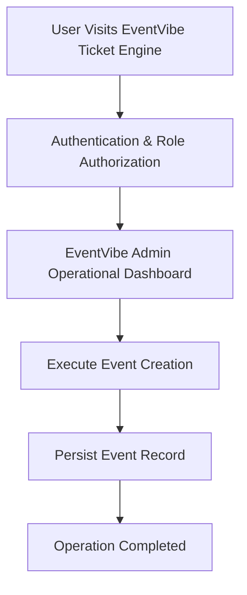

# Product Requirements Document

> **Document Status**: APPROVED & ACTIVE  
> **Target System**: EventVibe Ticket Engine  
> **Industry Domain**: EventVibe Ticket Engine Platform  
> **Risk Level**: LOW  
> **Data Sensitivity**: 3/10  

---

## 1. Product Overview
Event management platform for organizers, tickets, attendee registration, and QR check-in.

- Category: EventVibe Ticket Engine Platform
- Core Tech Stack: Next.js, TypeScript, PostgreSQL, REST API
- Primary Database Engine: PostgreSQL

## 2. Problem Statement
> [!IMPORTANT]
> **Core Domain Challenge**
> EventVibe Ticket Engine resolves critical domain operational challenges: EventVibe Ticket Engine resolves critical domain operational challenges: Event management platform for organizers, tickets, attendee registration, and QR check-in.

## 3. Goals & Objectives
1. Achieve automated workflows for Event Creation.
2. Achieve automated workflows for Ticket Sales.
3. Achieve automated workflows for Attendee Registration.
4. Achieve automated workflows for QR Check-in.

## 4. Non-Goals
- Legacy batch data ETL migration tooling for Event.
- Native desktop OS executable packaging for non-web environments.
- Hardware-level low-level firmware flashing for third-party peripheral sensors.

## 5. Target Users
Target user demographics for **EventVibe Ticket Engine** across EventVibe Ticket Engine Platform operations:

- EventVibe Admin: Needs Full control over EventVibe Ticket Engine operations and data management.
- Event Organizer: Needs Manage event listings and check-in scanners.
- Attendee: Needs Purchase tickets and present QR code for admission.

## 6. User Personas
| Persona Name | Role | Primary Pain Point | Key Motivation |
| :--- | :--- | :--- | :--- |
| Persona: EventVibe Admin | EventVibe Admin | Experiencing manual processing overhead in Full control over EventVibe Ticket Engine operations and data management. | Wants streamlined automated interface for Full control over EventVibe Ticket Engine operations and data management. |
| Persona: Event Organizer | Event Organizer | Experiencing manual processing overhead in Manage event listings and check-in scanners. | Wants streamlined automated interface for Manage event listings and check-in scanners. |
| Persona: Attendee | Attendee | Experiencing manual processing overhead in Purchase tickets and present QR code for admission. | Wants streamlined automated interface for Purchase tickets and present QR code for admission. |

## 7. User Roles
| Role | Core Need | Permission Level |
| :--- | :--- | :--- |
| EventVibe Admin | Full control over EventVibe Ticket Engine operations and data management. | Clearance Level 3 |
| Event Organizer | Manage event listings and check-in scanners. | Clearance Level 2 |
| Attendee | Purchase tickets and present QR code for admission. | Clearance Level 1 |

## 8. User Stories
*   *"As a EventVibe Admin, I want to execute Event Creation so data is synchronized accurately across the system."*

*   *"As a EventVibe Admin, I want to execute Ticket Sales so data is synchronized accurately across the system."*

*   *"As a EventVibe Admin, I want to execute Attendee Registration so data is synchronized accurately across the system."*

*   *"As a EventVibe Admin, I want to execute QR Check-in so data is synchronized accurately across the system."*

## 9. Functional Requirements
**Requirement 9.1 (Event Creation)**: System must execute automated processing for Event Creation with input validation.

**Requirement 9.2 (Ticket Sales)**: System must execute automated processing for Ticket Sales with input validation.

**Requirement 9.3 (Attendee Registration)**: System must execute automated processing for Attendee Registration with input validation.

**Requirement 9.4 (QR Check-in)**: System must execute automated processing for QR Check-in with input validation.

## 10. Non-Functional Requirements
- Performance: Sub-100ms client reactivity, <500ms API response latency for 95th percentile.
- Security: Data Sensitivity Score 3/10 with strict Zero Trust access control.
- Reliability: 99.9% uptime SLA with automated fallback boundaries.

## 11. Product Features
- Feature Module: Event Creation
- Feature Module: Ticket Sales
- Feature Module: Attendee Registration
- Feature Module: QR Check-in

## 12. User Flows

## 13. Scope
### 13.1 In Scope
- Core Workflow: Event Creation
- Core Workflow: Ticket Sales
- Core Workflow: Attendee Registration
- Core Workflow: QR Check-in

### 13.2 Out of Scope
- Legacy batch data ETL migration tooling for Event.
- Native desktop OS executable packaging for non-web environments.
- Hardware-level low-level firmware flashing for third-party peripheral sensors.

## 14. Business Rules
- Rule BR-01: Event admission QR tickets expire immediately upon single successful gate check-in scan.
- Rule BR-02: Total issued ticket quantity cannot exceed physical venue safety capacity.
- Rule BR-03: Ticket cancellations after event commencement are restricted.
- Rule BR-04: VIP seat reservations require verified organizer credential verification.

## 15. Acceptance Criteria
- [ ] Verify automated workflow for Event Creation
- [ ] Verify automated workflow for Ticket Sales
- [ ] Verify automated workflow for Attendee Registration
- [ ] Verify automated workflow for QR Check-in

## 16. Success Metrics / KPIs
- 95% reduction in manual data processing time.
- Zero critical security vulnerabilities on production release.

## 17. Constraints
- Constraint: Zero plaintext credentials
- Constraint: Strict type safety

## 18. Dependencies
- Database Service: PostgreSQL cluster availability.
- Runtime Platform: Node.js / Serverless Edge runtime environment.

## 19. Assumptions
- Users access the system using modern standards-compliant web browsers.
- Network latency to application host remains under 150ms.

## 20. Risks
> [!WARNING]
> **Risk Factor**
> Risk Level LOW: Potential operational delay if external infrastructure or database availability drops below target SLA.

## 21. Future Considerations
- Automated AI-assisted workflow predictive reporting for Event Creation.
- Realtime WebSockets push notification infrastructure for Event updates.
- Mobile native app SDK integration for on-the-field operators.