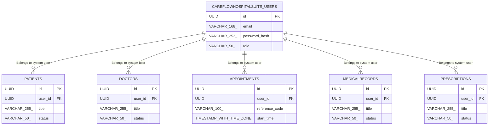

# Database Specification

> **DBMS Engine**: PostgreSQL  
> **Database Name**: careflow_hospital_suite  
> **Domain Industry**: CareFlow Hospital Suite Platform  
> **Database Complexity**: multi_tenant_schema  

---

## 1. Database Overview
Relational schema design for **CareFlow Hospital Suite** supporting ACID transactional integrity across 6 domain entity tables, optimized for the healthcare sector.

## 2. Database Technology
Database Engine: **PostgreSQL** configured specifically for CareFlow Hospital Suite schema storage with connection pooling.

## 3. Database Architecture
Primary-Replica HA deployment model supporting serverless_edge scalability requirements of CareFlow Hospital Suite.

## 4. Schema Overview
Relational tables cataloging domain entities for CareFlow Hospital Suite Platform: `careflowhospitalsuite_users`, `patients`, `doctors`, `appointments`, `medicalrecords`, `prescriptions`.

## 5. Entity Relationship Diagram

## 6. Tables
Primary entity tables: `careflowhospitalsuite_users`, `patients`, `doctors`, `appointments`, `medicalrecords`, `prescriptions`, and system `careflow_hospital_suite_audit_logs`.

## 7. Columns & Data Types
**careflowhospitalsuite_users**: `id` (UUID), `email` (VARCHAR(168)), `password_hash` (VARCHAR(252)), `role` (VARCHAR(50)), `created_at` (TIMESTAMP WITH TIME ZONE)

**patients**: `id` (UUID), `user_id` (UUID), `title` (VARCHAR(255)), `status` (VARCHAR(50)), `created_at` (TIMESTAMP WITH TIME ZONE)

**doctors**: `id` (UUID), `user_id` (UUID), `title` (VARCHAR(255)), `status` (VARCHAR(50)), `created_at` (TIMESTAMP WITH TIME ZONE)

**appointments**: `id` (UUID), `user_id` (UUID), `reference_code` (VARCHAR(100)), `start_time` (TIMESTAMP WITH TIME ZONE), `end_time` (TIMESTAMP WITH TIME ZONE), `status` (VARCHAR(50))

**medicalrecords**: `id` (UUID), `user_id` (UUID), `title` (VARCHAR(255)), `status` (VARCHAR(50)), `created_at` (TIMESTAMP WITH TIME ZONE)

**prescriptions**: `id` (UUID), `user_id` (UUID), `title` (VARCHAR(255)), `status` (VARCHAR(50)), `created_at` (TIMESTAMP WITH TIME ZONE)

## 8. Primary Keys
All CareFlow Hospital Suite domain tables enforce RFC 4122 random UUID primary keys.

## 9. Foreign Keys
`patients.user_id` → `careflowhospitalsuite_users.id` ON DELETE CASCADE

`doctors.user_id` → `careflowhospitalsuite_users.id` ON DELETE CASCADE

`appointments.user_id` → `careflowhospitalsuite_users.id` ON DELETE CASCADE

`medicalrecords.user_id` → `careflowhospitalsuite_users.id` ON DELETE CASCADE

`prescriptions.user_id` → `careflowhospitalsuite_users.id` ON DELETE CASCADE

## 10. Relationships
**Patient → User**: Belongs to system user (1:N)

**Doctor → User**: Belongs to system user (1:N)

**Appointments → User**: Belongs to system user (1:N)

**MedicalRecords → User**: Belongs to system user (1:N)

**Prescriptions → User**: Belongs to system user (1:N)

## 11. Constraints
NOT NULL (email, password_hash, role); UNIQUE (email); NOT NULL (title, status); NOT NULL (title, status); NOT NULL (user_id, reference_code, status); UNIQUE (reference_code); NOT NULL (title, status); NOT NULL (title, status)

## 12. Unique Constraints
UNIQUE indexes on natural key identifiers and authentication email addresses in the careflow_hospital_suite catalog.

## 13. Indexes
idx_careflowhospitalsuite_users_email (email), idx_careflowhospitalsuite_users_role (role), idx_patients_user (user_id), idx_patients_status (status), idx_doctors_user (user_id), idx_doctors_status (status), idx_appointments_user (user_id), idx_appointments_ref (reference_code), idx_medicalrecords_user (user_id), idx_medicalrecords_status (status), idx_prescriptions_user (user_id), idx_prescriptions_status (status)

## 14. Database Business Rules
Enforces domain business state transitions across entity lifecycles (pending_activation, active, suspended, archived, draft, active).

## 15. Authentication Data
User credentials and security tokens managed in `careflowhospitalsuite_users` with Argon2id hashing.

## 16. Authorization Data
Role-Based Access Control (RBAC) permissions stored in `careflowhospitalsuite_users.role` attributes.

## 17. Row-Level Security / Access Policies
PostgreSQL Row-Level Security (RLS) policies enabled on `careflowhospitalsuite_users`, `patients`, `doctors`, `appointments`, `medicalrecords`, `prescriptions` for client-level isolation.

## 18. Data Validation
CHECK constraints enforcing positive boundaries and non-empty strings on CareFlow Hospital Suite records.

## 19. Migrations
Version-controlled SQL migration scripts executing pre-release schema updates for the careflow_hospital_suite schema.

## 20. Seed Data
Initial development seed fixtures for `careflowhospitalsuite_users`, `patients`, `doctors`, `appointments`, `medicalrecords`, `prescriptions`.

## 21. Transactions & Data Integrity
ACID transactional boundaries with SERIALIZABLE isolation for mutations in CareFlow Hospital Suite.

## 22. Backup & Recovery
Automated WAL archive snapshots for CareFlow Hospital Suite with point-in-time recovery (PITR).

## 23. Database Security
Encrypted connections requiring TLS 1.3 and secret key vault integration for CareFlow Hospital Suite.

## 24. Performance Considerations
Sub-50ms query latency targets using EXPLAIN ANALYZE execution plan auditing on the PostgreSQL engine.

## 25. Data Retention
Soft-delete pattern with 90-day archive retention policies.

## 26. Database Change Log
Audit table logging schema migration versions for CareFlow Hospital Suite.