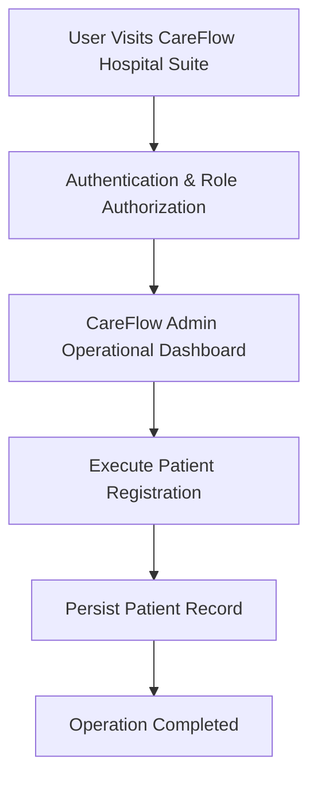

# Product Requirements Document

> **Document Status**: APPROVED & ACTIVE  
> **Target System**: CareFlow Hospital Suite  
> **Industry Domain**: CareFlow Hospital Suite Platform  
> **Risk Level**: CRITICAL  
> **Data Sensitivity**: 10/10  

---

## 1. Product Overview
Clinical management system for doctors, patients, appointments, medical records, and prescriptions.

- Category: CareFlow Hospital Suite Platform
- Core Tech Stack: React, TypeScript, PostgreSQL, REST API
- Primary Database Engine: PostgreSQL

## 2. Problem Statement
> [!IMPORTANT]
> **Core Domain Challenge**
> CareFlow Hospital Suite resolves critical domain operational challenges: CareFlow Hospital Suite resolves critical domain operational challenges: Clinical management system for doctors, patients, appointments, medical records, and prescriptions.

## 3. Goals & Objectives
1. Achieve automated workflows for Patient Registration.
2. Achieve automated workflows for Doctor Management.
3. Achieve automated workflows for Appointments.
4. Achieve automated workflows for Medical Records.
5. Achieve automated workflows for Prescriptions.

## 4. Non-Goals
- Legacy batch data ETL migration tooling for Patient.
- Native desktop OS executable packaging for non-web environments.
- Hardware-level low-level firmware flashing for third-party peripheral sensors.

## 5. Target Users
Target user demographics for **CareFlow Hospital Suite** across CareFlow Hospital Suite Platform operations:

- CareFlow Admin: Needs Full control over CareFlow Hospital Suite operations and data management.
- Clinical Provider: Needs Access patient records and update medical histories.
- Patient: Needs Book appointments and view medical prescriptions.

## 6. User Personas
| Persona Name | Role | Primary Pain Point | Key Motivation |
| :--- | :--- | :--- | :--- |
| Persona: CareFlow Admin | CareFlow Admin | Experiencing manual processing overhead in Full control over CareFlow Hospital Suite operations and data management. | Wants streamlined automated interface for Full control over CareFlow Hospital Suite operations and data management. |
| Persona: Clinical Provider | Clinical Provider | Experiencing manual processing overhead in Access patient records and update medical histories. | Wants streamlined automated interface for Access patient records and update medical histories. |
| Persona: Patient | Patient | Experiencing manual processing overhead in Book appointments and view medical prescriptions. | Wants streamlined automated interface for Book appointments and view medical prescriptions. |

## 7. User Roles
| Role | Core Need | Permission Level |
| :--- | :--- | :--- |
| CareFlow Admin | Full control over CareFlow Hospital Suite operations and data management. | Clearance Level 3 |
| Clinical Provider | Access patient records and update medical histories. | Clearance Level 2 |
| Patient | Book appointments and view medical prescriptions. | Clearance Level 1 |

## 8. User Stories
*   *"As a CareFlow Admin, I want to execute Patient Registration so data is synchronized accurately across the system."*

*   *"As a CareFlow Admin, I want to execute Doctor Management so data is synchronized accurately across the system."*

*   *"As a CareFlow Admin, I want to execute Appointments so data is synchronized accurately across the system."*

*   *"As a CareFlow Admin, I want to execute Medical Records so data is synchronized accurately across the system."*

*   *"As a CareFlow Admin, I want to execute Prescriptions so data is synchronized accurately across the system."*

## 9. Functional Requirements
**Requirement 9.1 (Patient Registration)**: System must execute automated processing for Patient Registration with input validation.

**Requirement 9.2 (Doctor Management)**: System must execute automated processing for Doctor Management with input validation.

**Requirement 9.3 (Appointments)**: System must execute automated processing for Appointments with input validation.

**Requirement 9.4 (Medical Records)**: System must execute automated processing for Medical Records with input validation.

**Requirement 9.5 (Prescriptions)**: System must execute automated processing for Prescriptions with input validation.

## 10. Non-Functional Requirements
- Performance: Sub-100ms client reactivity, <500ms API response latency for 95th percentile.
- Security: Data Sensitivity Score 10/10 with strict Zero Trust access control.
- Reliability: 99.9% uptime SLA with automated fallback boundaries.

## 11. Product Features
- Feature Module: Patient Registration
- Feature Module: Doctor Management
- Feature Module: Appointments
- Feature Module: Medical Records
- Feature Module: Prescriptions

## 12. User Flows

## 13. Scope
### 13.1 In Scope
- Core Workflow: Patient Registration
- Core Workflow: Doctor Management
- Core Workflow: Appointments
- Core Workflow: Medical Records
- Core Workflow: Prescriptions

### 13.2 Out of Scope
- Legacy batch data ETL migration tooling for Patient.
- Native desktop OS executable packaging for non-web environments.
- Hardware-level low-level firmware flashing for third-party peripheral sensors.

## 14. Business Rules
- Rule BR-01: Medical prescriptions can only be issued by credentialed Physicians during an active consultation.
- Rule BR-02: Patient electronic health records must remain immutable once finalized and enforce HIPAA audit trails.
- Rule BR-03: Overlapping doctor consultation appointments for identical time slots are rejected.
- Rule BR-04: Emergency care overrides require dual-signature authorization from head clinical staff.

## 15. Acceptance Criteria
- [ ] Verify automated workflow for Patient Registration
- [ ] Verify automated workflow for Doctor Management
- [ ] Verify automated workflow for Appointments
- [ ] Verify automated workflow for Medical Records
- [ ] Verify automated workflow for Prescriptions

## 16. Success Metrics / KPIs
- 95% reduction in manual data processing time.
- Zero critical security vulnerabilities on production release.

## 17. Constraints
- Constraint: Zero plaintext credentials
- Constraint: Strict type safety

## 18. Dependencies
- Database Service: PostgreSQL cluster availability.
- Runtime Platform: Node.js / Serverless Edge runtime environment.

## 19. Assumptions
- Users access the system using modern standards-compliant web browsers.
- Network latency to application host remains under 150ms.

## 20. Risks
> [!WARNING]
> **Risk Factor**
> Risk Level CRITICAL: Potential operational delay if external infrastructure or database availability drops below target SLA.

## 21. Future Considerations
- Automated AI-assisted workflow predictive reporting for Patient Registration.
- Realtime WebSockets push notification infrastructure for Patient updates.
- Mobile native app SDK integration for on-the-field operators.