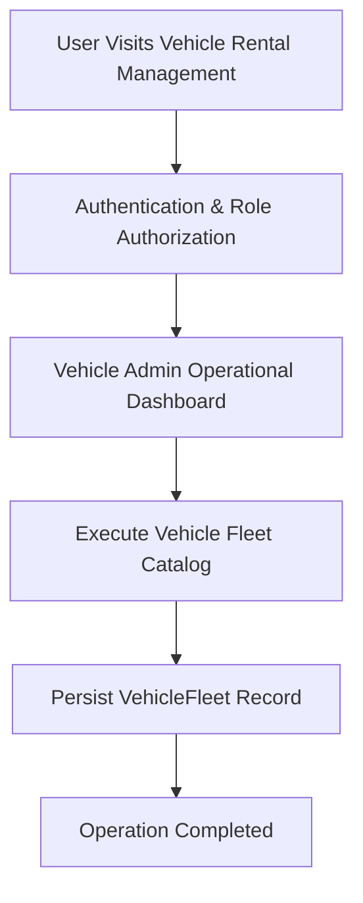

# Product Requirements Document

> **Document Status**: APPROVED & ACTIVE  
> **Target System**: Vehicle Rental Management  
> **Industry Domain**: Vehicle Rental Management Platform  
> **Risk Level**: LOW  
> **Data Sensitivity**: 3/10  

---

## 1. Product Overview
Fleet vehicle reservation platform for customers, car rentals, vehicle availability, returns, and inspection tracking.

- Category: Vehicle Rental Management Platform
- Core Tech Stack: React, TypeScript, PostgreSQL, REST API
- Primary Database Engine: PostgreSQL

## 2. Problem Statement
> [!IMPORTANT]
> **Core Domain Challenge**
> Vehicle Rental Management resolves critical domain operational challenges: Vehicle Rental Management resolves critical domain operational challenges: Fleet vehicle reservation platform for customers, car rentals, vehicle availability, returns, and inspection tracking.

## 3. Goals & Objectives
1. Achieve automated workflows for Vehicle Fleet Catalog.
2. Achieve automated workflows for Customer Reservations.
3. Achieve automated workflows for Rental Return Tracking.
4. Achieve automated workflows for Vehicle Inspection.

## 4. Non-Goals
- Legacy batch data ETL migration tooling for VehicleFleet.
- Native desktop OS executable packaging for non-web environments.
- Hardware-level low-level firmware flashing for third-party peripheral sensors.

## 5. Target Users
Target user demographics for **Vehicle Rental Management** across Vehicle Rental Management Platform operations:

- Vehicle Admin: Needs Full control over Vehicle Rental Management operations and data management.
- Fleet Manager: Needs Track vehicle availability and maintain fleet condition.
- Customer / Renter: Needs Reserve vehicles online and process rental returns.

## 6. User Personas
| Persona Name | Role | Primary Pain Point | Key Motivation |
| :--- | :--- | :--- | :--- |
| Persona: Vehicle Admin | Vehicle Admin | Experiencing manual processing overhead in Full control over Vehicle Rental Management operations and data management. | Wants streamlined automated interface for Full control over Vehicle Rental Management operations and data management. |
| Persona: Fleet Manager | Fleet Manager | Experiencing manual processing overhead in Track vehicle availability and maintain fleet condition. | Wants streamlined automated interface for Track vehicle availability and maintain fleet condition. |
| Persona: Customer / Renter | Customer / Renter | Experiencing manual processing overhead in Reserve vehicles online and process rental returns. | Wants streamlined automated interface for Reserve vehicles online and process rental returns. |

## 7. User Roles
| Role | Core Need | Permission Level |
| :--- | :--- | :--- |
| Vehicle Admin | Full control over Vehicle Rental Management operations and data management. | Clearance Level 3 |
| Fleet Manager | Track vehicle availability and maintain fleet condition. | Clearance Level 2 |
| Customer / Renter | Reserve vehicles online and process rental returns. | Clearance Level 1 |

## 8. User Stories
*   *"As a Vehicle Admin, I want to execute Vehicle Fleet Catalog so data is synchronized accurately across the system."*

*   *"As a Vehicle Admin, I want to execute Customer Reservations so data is synchronized accurately across the system."*

*   *"As a Vehicle Admin, I want to execute Rental Return Tracking so data is synchronized accurately across the system."*

*   *"As a Vehicle Admin, I want to execute Vehicle Inspection so data is synchronized accurately across the system."*

## 9. Functional Requirements
**Requirement 9.1 (Vehicle Fleet Catalog)**: System must execute automated processing for Vehicle Fleet Catalog with input validation.

**Requirement 9.2 (Customer Reservations)**: System must execute automated processing for Customer Reservations with input validation.

**Requirement 9.3 (Rental Return Tracking)**: System must execute automated processing for Rental Return Tracking with input validation.

**Requirement 9.4 (Vehicle Inspection)**: System must execute automated processing for Vehicle Inspection with input validation.

## 10. Non-Functional Requirements
- Performance: Sub-100ms client reactivity, <500ms API response latency for 95th percentile.
- Security: Data Sensitivity Score 3/10 with strict Zero Trust access control.
- Reliability: 99.9% uptime SLA with automated fallback boundaries.

## 11. Product Features
- Feature Module: Vehicle Fleet Catalog
- Feature Module: Customer Reservations
- Feature Module: Rental Return Tracking
- Feature Module: Vehicle Inspection

## 12. User Flows

## 13. Scope
### 13.1 In Scope
- Core Workflow: Vehicle Fleet Catalog
- Core Workflow: Customer Reservations
- Core Workflow: Rental Return Tracking
- Core Workflow: Vehicle Inspection

### 13.2 Out of Scope
- Legacy batch data ETL migration tooling for VehicleFleet.
- Native desktop OS executable packaging for non-web environments.
- Hardware-level low-level firmware flashing for third-party peripheral sensors.

## 14. Business Rules
- Rule BR-01: Vehicles must pass safety inspection and be marked active before accepting customer reservations.
- Rule BR-02: Rental return processing requires mandatory odometer mileage recording and condition defect logging.
- Rule BR-03: Double-booking the same vehicle for overlapping reservation dates is strictly prohibited.
- Rule BR-04: Security deposits cannot be released if unrecorded return damages are detected during inspection.

## 15. Acceptance Criteria
- [ ] Verify automated workflow for Vehicle Fleet Catalog
- [ ] Verify automated workflow for Customer Reservations
- [ ] Verify automated workflow for Rental Return Tracking
- [ ] Verify automated workflow for Vehicle Inspection

## 16. Success Metrics / KPIs
- 95% reduction in manual data processing time.
- Zero critical security vulnerabilities on production release.

## 17. Constraints
- Constraint: Zero plaintext credentials
- Constraint: Strict type safety

## 18. Dependencies
- Database Service: PostgreSQL cluster availability.
- Runtime Platform: Node.js / Serverless Edge runtime environment.

## 19. Assumptions
- Users access the system using modern standards-compliant web browsers.
- Network latency to application host remains under 150ms.

## 20. Risks
> [!WARNING]
> **Risk Factor**
> Risk Level LOW: Potential operational delay if external infrastructure or database availability drops below target SLA.

## 21. Future Considerations
- Automated AI-assisted workflow predictive reporting for Vehicle Fleet Catalog.
- Realtime WebSockets push notification infrastructure for VehicleFleet updates.
- Mobile native app SDK integration for on-the-field operators.